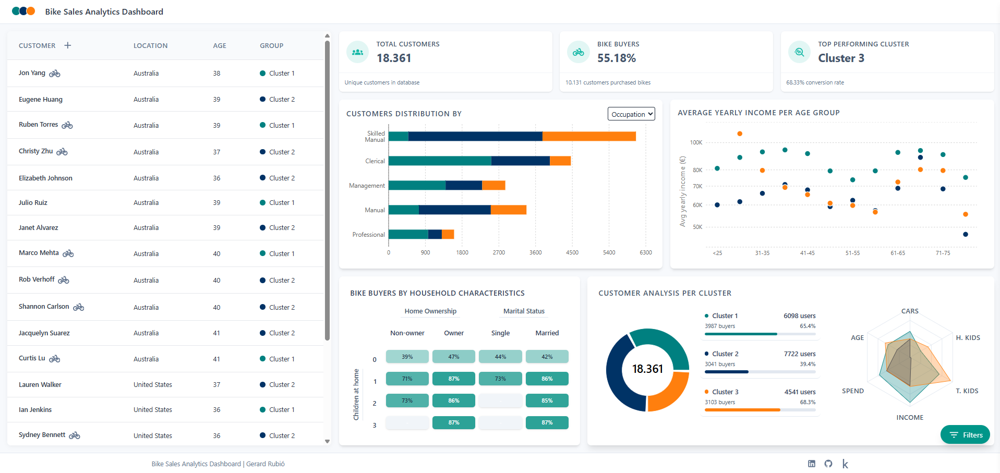

# Bike Sales Analytics Dashboard

Interactive dashboard for exploring customer segments and bike purchase behavior using data derived from Microsoft's AdventureWorks sample database.

This repository focuses on the **dashboard layer** of the project: turning an existing customer analysis and clustering workflow into a visual, interactive web application.

## Live Demo

[Go to the Live Demo Dashboard](https://customer-bike-sales.vercel.app/)

## Preview



## Project Context

The data analysis and customer segmentation were developed in a related Kaggle notebook from my account:

[RELATED KAGGLE NOTEBOOK - Clustering and Analysis bike customers](https://www.kaggle.com/code/gerardrubio00/clustering-and-analysis-bike-customers)

That notebook contains the analytical part of the project. This repository adds the web dashboard, making the results easier to explore and present.

The source data comes from **AdventureWorks**, Microsoft's sample database that represents a fictional bicycle company. The exported customer and sales data are processed in R, segmented into clusters, and converted into `clustering_results.json`, which is consumed by the dashboard.

## The Dashboard

The application helps explore:

- Customer segments based on demographic, financial, and household variables.
- Bike buyer conversion by cluster.
- Differences between clusters in income, age, spending, children, cars owned, and home ownership.
- Which customer groups may be more valuable for marketing or sales actions.

Main dashboard features:

- Customer table with cluster and bike buyer indicators.
- Global filters by cluster, country, gender, and buyer status.
- KPI cards for total customers, buyer rate, and best-performing cluster.
- Distribution chart by occupation or education.
- Average yearly income by age group and cluster.
- Heatmap of bike buyers by household characteristics.
- Cluster comparison using summary cards and a radar chart.
- New customer classification form connected to an R API.

## Clustering And Prediction

Customers are segmented into **3 clusters** using PAM, Partitioning Around Medoids, with Gower distance. This method is suitable for mixed data because the dataset contains both numerical and categorical variables.

The dashboard also includes a new customer classification flow. A user can enter customer information, and the app sends it to an R Plumber API that assigns the closest cluster and returns a confidence score.
Note: if the API server has been inactive for more than 20 minutes, the first prediction request may take longer than usual while the service starts again.

This classification is for demonstration purposes: the new customer is not stored in the dataset.

## Tech Stack

- Next.js 15
- React 19
- TypeScript
- Tailwind CSS
- Recharts
- R
- tidyverse
- cluster
- proxy
- jsonlite
- plumber

## Project Structure

```text
src/
  app/
    api/predict/       # Next.js proxy for new customer prediction
    page.tsx           # Dashboard page
  components/          # Dashboard UI components
  context/             # Global state for filters and customers

scripts/
  R/
    clustering_bike_customers.R  # Clustering pipeline (kaggle notebook)
    new_customer_api.R           # Plumber API for customer classification
```

## Local Setup

Requirements:

- Node.js
- npm
- R, only if you want to reproduce the analysis or run the classification API

```bash
npm install
npm run dev
```

Then open:

```text
http://localhost:3000
```

The dashboard expects this generated file:

```text
public/clustering_results.json
```
It is produced by the R clustering workflow.

## Project purpose

This project demonstrates the ability to connect data analysis with a usable frontend product. It is not intended to be a full production application, but a portfolio project showing the complete path from customer segmentation to an interactive dashboard.


## Contact

Gerard Rubió - gerard.rubio2000@gmail.com
Project Link: [https://github.com/gerardrubiopullina/customer-bike-sales](https://github.com/gerardrubiopullina/customer-bike-sales)
